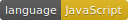
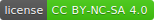

# Multi-Language JavaScript Keyboard


[](https://creativecommons.org/licenses/by-nc-sa/4.0/)

​Extremely easy to customize and extend JavaScript-only keyboard​.

[Example available here](http://javascript-keyboard.edcordata.com/).


##### Currently available languages are:
  * English (US) (en-us)
  * IPA - International Phonetic Alphabet
  * Latvian (lv)
  * Korean (ko)
  * Chinese (zh)
  * Norwegian (no)
  * Danish (da)
  * Ukrainian (uk)
  * Bosnian (bs)
  * Lithuanian (lt)
  * Spanish (es)
  * Portuguese (pt)
  * Japanese (ja)
  * Slovenian (sl)
  * Persian (fa)
  * Polish (pl)
  * Czech (cs)
  * Turkish (tr)
  * Estonian (et)
  * Finnish (fi)
  * Serbian Latin (sr)
  * Slovak (sk)
  * Italian (it)
  * Hungarian (hu)
  * Croatian (hr)
  * Belarusian (be)
  * German (de)
  * Dutch (nl)
  * Swedish (sv)
  * Russian (ru)
  * Arabic (ar)


<br/>


## Installation

Load styles:
```html
<link rel="stylesheet" href="dist/multiLangKeyboard.min.css">
```

Load core plugin and languages you need:
```html
<script type="application/javascript" src="dist/multiLangKeyboard.min.js"></script>
<script type="application/javascript" src="dist/keyboards/multiLangKeyboard-en.min.js"></script>
```

Note: Core plugin doesn't have any keyboards included, not even english, so make sure
you include at least one language file.


<br/>


## Usage

```js
multiLangKeyboard.render('en-us', '.keyboard-wrap-selector', '.input-selector');
```


<br/>


## Available options
Note: Must be called before `.render` function.
```js
multiLangKeyboard.options.wrapClass = 'multi-lang-keyboard-wrap';
multiLangKeyboard.options.localize  = {
  backspace: 'Backspace',
  enter:     'Enter',
  space:     'Space',
  shift:     'Shift',
  alt:       'Alt'
};
```


<br/>


## Available functions

###### .version
```js
multiLangKeyboard.version;
```

###### .availableKeyboards()
```js
multiLangKeyboard.availableKeyboards();
```
Returns array of available keyboards:
```json
[ {"code": "en-us", "name": "English (US)"} ]
```

###### .addKeyboard('Name', 'code', [layout])
Add custom layouts. For examples check `src/keyboards/`
```js
multiLangKeyboard.addKeyboard('English (UK)', 'en-gb', []);
```

###### .render('language code', '.wrap-css-selector')
```js
multiLangKeyboard.render('en-us', '.keyboard-wrap');
```

###### .renderHTML('language code')
Returns only HTML for the keyboard.
```js
multiLangKeyboard.renderHTML('en-us');
```

###### .addEvents(element, input_element)
Add click events for keyboard. This get's called automatically when
running `.render()` function. Generally you should use `.render()` function.
Note that the element here needs to be root element, generated by function
`.renderHTML()`, not the element that generated html is placed in. Example:
```js
var wrap       = document.querySelector('#keyboard-wrap');
wrap.innerHTML = multiLangKeyboard.renderHTML('en-us');

var keyboard   = wrap.querySelector('.multi-lang-keyboard-wrap');
var input      = document.querySelector('input');

multiLangKeyboard.addEvents(keyboard, input);
```


<br/>


## License
This project is licensed under
[CC BY-NC-SA 4.0](https://creativecommons.org/licenses/by-nc-sa/4.0/) license,
which means this plugin is free for personal use only.

Contact info:
<br/>
[https://github.com/EdCordata](https://github.com/EdCordata)
